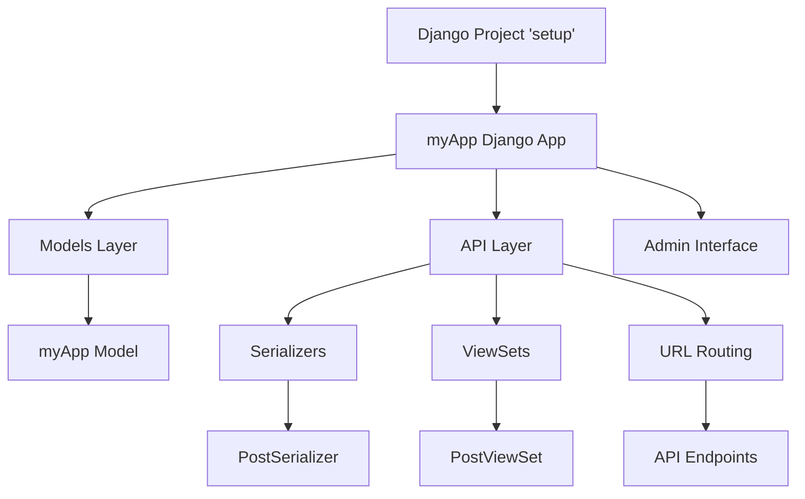
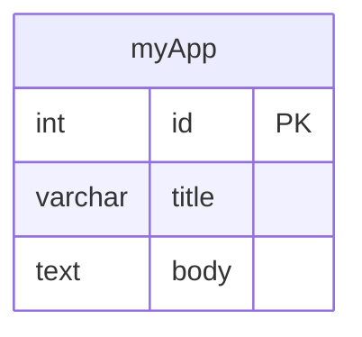
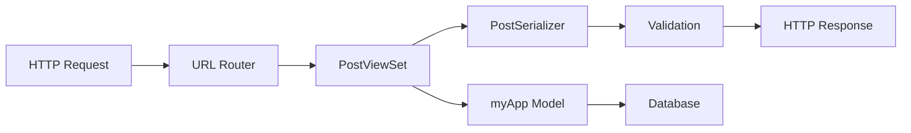
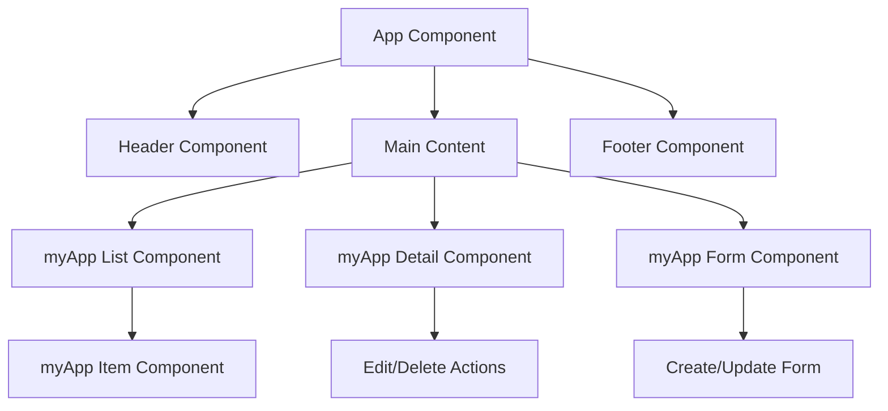
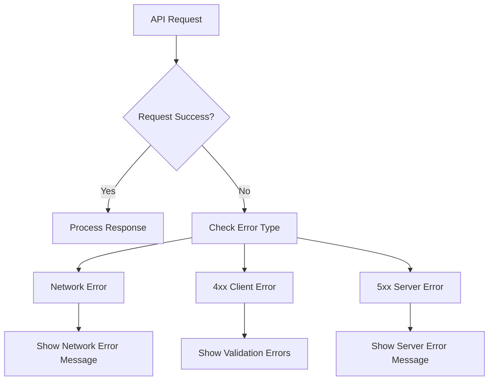
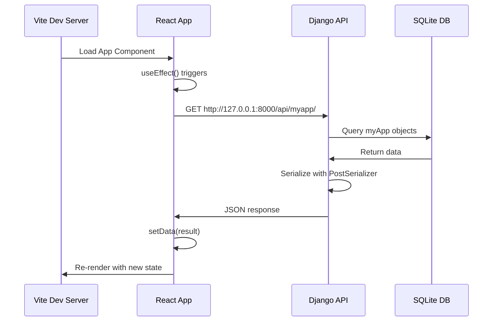
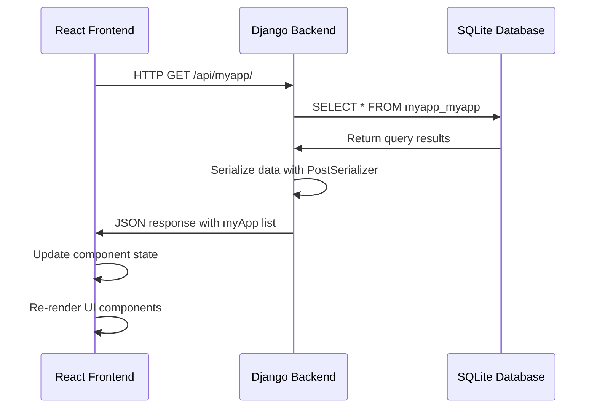
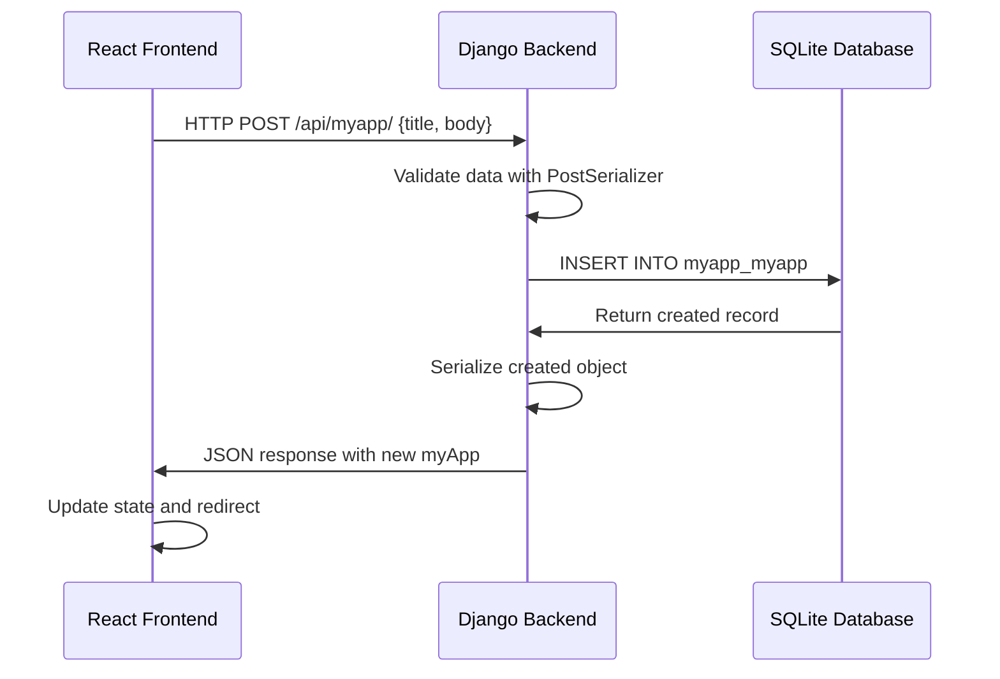
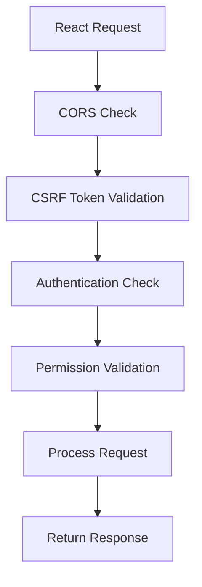

# Django-React Full-Stack Application Design Document

## Overview

This document outlines the design for a full-stack web application using Django as the backend API and React as the frontend client. The application follows a decoupled architecture where Django provides RESTful APIs consumed by a React single-page application.

### Project Structure
```
django-react/
├── setup/                    # Django Backend
│   ├── myApp/               # Main Django Application
│   │   ├── api/             # API Layer
│   │   │   ├── serializers.py
│   │   │   ├── views.py
│   │   │   └── urls.py
│   │   ├── migrations/      # Database Migrations
│   │   ├── models.py        # Data Models
│   │   └── ...
│   ├── setup/               # Django Project Configuration
│   └── manage.py            # Django Management Commands
└── frontend/                # React Frontend (Implemented)
    ├── src/
    │   ├── App.tsx          # Main React Component
    │   ├── main.tsx         # React Entry Point
    │   └── vite-env.d.ts    # Vite Type Definitions
    ├── .env                 # Environment Variables
    ├── package.json         # Dependencies
    ├── vite.config.ts       # Vite Configuration
    └── tsconfig.app.json    # TypeScript Configuration
```

### Technology Stack
- **Backend**: Django 5.2.6 + Django REST Framework
- **Frontend**: React 19.1.1 + TypeScript + Vite 7.1.2
- **Database**: SQLite (development), PostgreSQL (production)
- **API**: RESTful API with JSON responses
- **CORS**: django-cors-headers for cross-origin requests
- **Build Tool**: Vite with React plugin
- **Type Safety**: TypeScript with strict configuration
- **Development Server**: Vite dev server on localhost:5173

## Backend Architecture

### Django Project Structure



### API Endpoints Reference

| Method | Endpoint | Description | Request Body | Response |
|--------|----------|-------------|--------------|----------|
| GET | `/api/myapp/` | List all myApp items | - | Array of myApp objects |
| POST | `/api/myapp/` | Create new myApp item | `{title, body}` | Created myApp object |
| GET | `/api/myapp/{id}/` | Get specific myApp item | - | Single myApp object |
| PUT | `/api/myapp/{id}/` | Update myApp item | `{title, body}` | Updated myApp object |
| PATCH | `/api/myapp/{id}/` | Partial update | `{title}` or `{body}` | Updated myApp object |
| DELETE | `/api/myapp/{id}/` | Delete myApp item | - | 204 No Content |

#### Request/Response Schema

**myApp Object Schema:**
```json
{
  "id": "integer",
  "title": "string (max 100 chars)",
  "body": "string (text field)"
}
```

**Example API Response:**
```json
{
  "id": 1,
  "title": "Sample Title",
  "body": "Sample body content"
}
```

### Data Models & ORM Mapping



**Model Definition:**
- **myApp Model**
  - `id`: Auto-increment primary key
  - `title`: CharField with max_length=100
  - `body`: TextField for longer content
  - `__str__()`: Returns formatted string representation

### Business Logic Layer

#### myApp Feature Architecture



**PostViewSet Responsibilities:**
- Handle CRUD operations for myApp objects
- Automatic pagination and filtering
- Content negotiation (JSON responses)
- Error handling and validation
- Extends ModelViewSet for full CRUD functionality

**PostSerializer Responsibilities:**
- Data validation and transformation
- JSON serialization/deserialization
- Field-level and object-level validation
- Maps myApp model to JSON format

### Middleware & Configuration

**Active Middleware Stack:**
1. `CorsMiddleware` - CORS handling (positioned first for proper preflight handling)
2. `SecurityMiddleware` - Security headers
3. `SessionMiddleware` - Session management
4. `CommonMiddleware` - Common functionality
5. `CsrfViewMiddleware` - CSRF protection
6. `AuthenticationMiddleware` - User authentication
7. `MessageMiddleware` - Message framework
8. `ClickjackingMiddleware` - Clickjacking protection

**CORS Configuration:**
- Development: `CORS_ALLOW_ALL_ORIGINS = True` (all origins allowed)
- Production: Restricted to specific origins (localhost:5173, 127.0.0.1:5173)
- Credentials support: `CORS_ALLOW_CREDENTIALS = True`
- Allowed methods: GET, POST, PUT, PATCH, DELETE, OPTIONS
- Custom headers: Authorization, Content-Type, X-CSRFToken
- Positioned at top of middleware stack for proper request handling

## Frontend Architecture

### React + TypeScript + Vite Setup

**Project Configuration:**
- **React Version**: 19.1.1 with latest features
- **TypeScript**: Strict configuration with ESNext target
- **Build Tool**: Vite 7.1.2 for fast development and building
- **Dev Server**: Runs on `http://localhost:5173`
- **Environment Variables**: Managed through `.env` file

**Frontend Dependencies:**
```json
{
  "dependencies": {
    "react": "^19.1.1",
    "react-dom": "^19.1.1"
  },
  "devDependencies": {
    "@vitejs/plugin-react": "^5.0.0",
    "typescript": "~5.8.3",
    "vite": "^7.1.2",
    "eslint": "^9.33.0"
  }
}
```

### Component Architecture

**Current Implementation:**

```typescript
// App.tsx - Main Component Implementation
interface Post {
  id: number;
  title: string;
  body: string;
}

const App = () => {
  const [data, setData] = useState<Post[]>([]);
  
  useEffect(() => {
    async function fetchData() {
      try {
        const response = await fetch(`${import.meta.env.VITE_API_URL}`);
        const result = await response.json();
        setData(result);
      } catch (error) {
        console.log(error);
      }
    }
    fetchData();
  }, []);
  
  return (
    <div className="app">
      <h1>Hello World!</h1>
      {/* Data display implementation goes here */}
    </div>
  );
};
```

**Planned Component Architecture:**



#### Component Hierarchy

**Root Level Components:**
- `App`: Main application container
- `Header`: Navigation and branding
- `Footer`: Site footer information

**Feature Components:**
- `myAppList`: Display list of myApp items
- `myAppDetail`: Show individual myApp details
- `myAppForm`: Create/edit myApp items
- `myAppItem`: Individual item in list view

#### Current State Management

**Implemented Features:**
- TypeScript interfaces for type safety (`Post` interface)
- React hooks for state management (`useState`, `useEffect`)
- Async/await pattern for API calls
- Environment variable configuration for API endpoints
- Error handling for network requests

**State Structure:**
```typescript
interface Post {
  id: number;
  title: string;
  body: string;
}

const [data, setData] = useState<Post[]>([]);
```

**Component Props Structure:**
```javascript
// myAppItem Props
{
  item: {
    id: number,
    title: string,
    body: string
  },
  onEdit: (id) => void,
  onDelete: (id) => void
}

// myAppForm Props
{
  item?: myAppObject,
  onSubmit: (data) => void,
  onCancel: () => void
}
```

**State Management Strategy:**
- Local component state for UI interactions
- Context API for global app state
- Custom hooks for API operations

### Routing & Navigation

```mermaid
graph LR
    A[/] --> B[Home Page]
    A --> C[/myapp] --> D[myApp List]
    A --> E[/myapp/:id] --> F[myApp Detail]
    A --> G[/myapp/new] --> H[Create myApp]
    A --> I[/myapp/:id/edit] --> J[Edit myApp]
```

**Route Configuration:**
- `/` - Home/dashboard page
- `/myapp` - List all myApp items
- `/myapp/:id` - View specific myApp item
- `/myapp/new` - Create new myApp item
- `/myapp/:id/edit` - Edit existing myApp item

### API Integration Layer

#### Environment Configuration

**Development Environment Variables (.env):**
```bash
# Current API endpoint for data fetching
VITE_API_URL=http://127.0.0.1:8000/api/myapp/

# Alternative generic API endpoint
# VITE_API_URL=http://127.0.0.1:8000/api/
```

**Protocol Configuration:**
- Uses `http://` protocol for development (not `https://`)
- Connects to `127.0.0.1:8000` (Django development server)
- Vite automatically loads `.env` variables with `VITE_` prefix

#### Current HTTP Client Implementation

```typescript
// Implemented in App.tsx
const fetchData = async () => {
  try {
    const response = await fetch(`${import.meta.env.VITE_API_URL}`);
    if (!response.ok) {
      throw new Error('Network response was not ok');
    }
    const result = await response.json();
    console.log(result); // Debug logging
    setData(result);
  } catch (error) {
    console.log(error); // Error logging
  }
};
```

**Error Handling Implementation:**
- Network response validation
- Try-catch blocks for async operations
- Console logging for debugging
- Graceful error handling without UI disruption

**Data Flow Process:**
1. Component mounts (`useEffect` dependency array: `[]`)
2. Fetch data from Django API endpoint
3. Parse JSON response
4. Update React state with `setData(result)`
5. Component re-renders with new data

#### API Service Implementation

**Current Data Fetching:**
```typescript
// Simple fetch implementation
const response = await fetch(`${import.meta.env.VITE_API_URL}`);
const result = await response.json();
```

**Planned API Service Methods:**
```typescript
const myAppService = {
  getAll: () => fetch(`${import.meta.env.VITE_API_URL}`),
  getById: (id: number) => fetch(`${import.meta.env.VITE_API_URL}${id}/`),
  create: (data: Omit<Post, 'id'>) => 
    fetch(`${import.meta.env.VITE_API_URL}`, {
      method: 'POST',
      headers: { 'Content-Type': 'application/json' },
      body: JSON.stringify(data)
    }),
  update: (id: number, data: Omit<Post, 'id'>) => 
    fetch(`${import.meta.env.VITE_API_URL}${id}/`, {
      method: 'PUT',
      headers: { 'Content-Type': 'application/json' },
      body: JSON.stringify(data)
    }),
  delete: (id: number) => 
    fetch(`${import.meta.env.VITE_API_URL}${id}/`, {
      method: 'DELETE'
    })
};
```

#### Error Handling Strategy



### Current Data Display Implementation

**Data Fetching Flow:**


**Current Implementation Status:**
- ✅ API endpoint connection established
- ✅ Data fetching with error handling
- ✅ TypeScript interface for type safety
- ✅ State management with React hooks
- ❌ Data display in UI (currently just "Hello World!")
- ❌ CRUD operations UI
- ❌ Loading states and error UI

## Data Flow Between Layers

### Production Request Flow Architecture



### Create Operation Flow



### Authentication & Security Flow



## Testing Strategy

### Backend Testing

**Unit Testing Framework**: Django TestCase
- Model testing for data validation
- Serializer testing for API contracts
- ViewSet testing for endpoint behavior

**Test Categories:**
- **Model Tests**: Validate field constraints and methods
- **API Tests**: Test all CRUD endpoints
- **Integration Tests**: Test complete request/response cycles

**Example Test Structure:**
```python
class myAppModelTest(TestCase):
    def test_string_representation(self):
        # Test __str__ method
        
    def test_field_validation(self):
        # Test model field constraints

class PostViewSetTest(APITestCase):
    def test_get_myapp_list(self):
        # Test GET /api/myapp/
        
    def test_create_myapp(self):
        # Test POST /api/myapp/
        
    def test_post_serializer(self):
        # Test PostSerializer validation
```

### Frontend Testing Strategy

**Testing Libraries Setup:**
- Jest (configured with Vite)
- React Testing Library for component testing
- TypeScript support in tests
- ESLint configuration for code quality

**Current ESLint Configuration:**
```typescript
// eslint.config.js
import js from '@eslint/js'
import globals from 'globals'
import reactHooks from 'eslint-plugin-react-hooks'
import reactRefresh from 'eslint-plugin-react-refresh'
import tseslint from 'typescript-eslint'

export default tseslint.config([
  { files: ['**/*.{ts,tsx}'] },
  {
    extends: [
      js.configs.recommended,
      tseslint.configs.recommended,
      reactHooks.configs['recommended-latest'],
      reactRefresh.configs.vite,
    ],
    languageOptions: {
      ecmaVersion: 2020,
      globals: globals.browser,
    },
  },
])
```

### Integration Testing

**API Integration Testing:**
- Test Django API endpoints with React HTTP client
- Validate request/response formats
- Test error handling scenarios
- Performance testing for API response times

**Database Integration:**
- Test migrations and schema changes
- Validate data integrity constraints
- Test backup and restore procedures