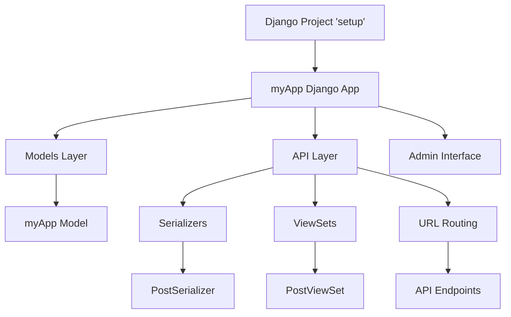
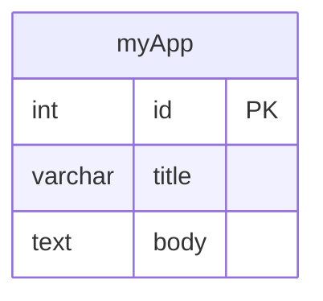
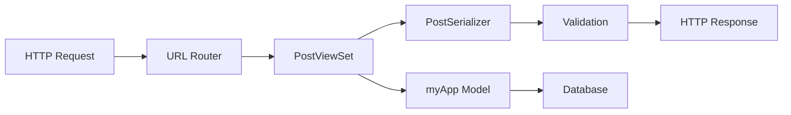
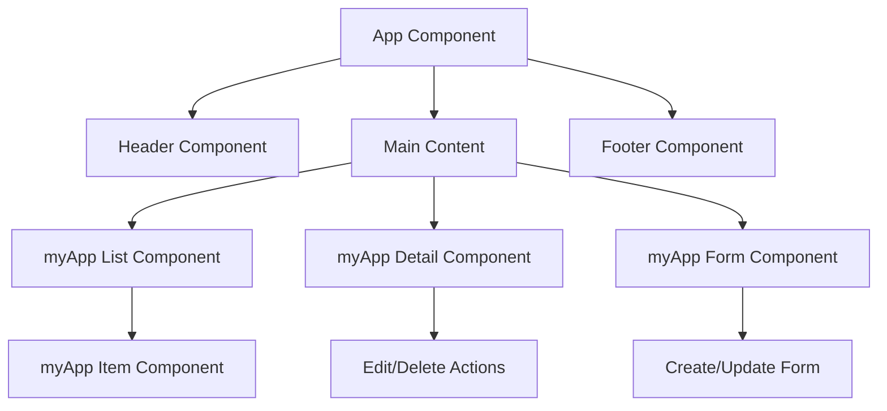
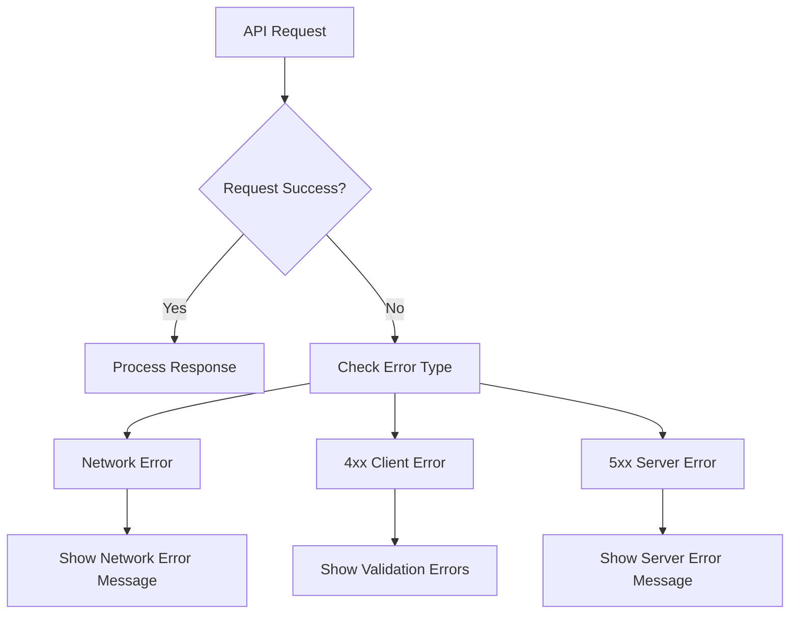
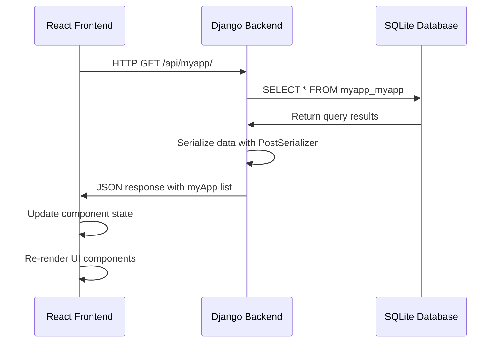
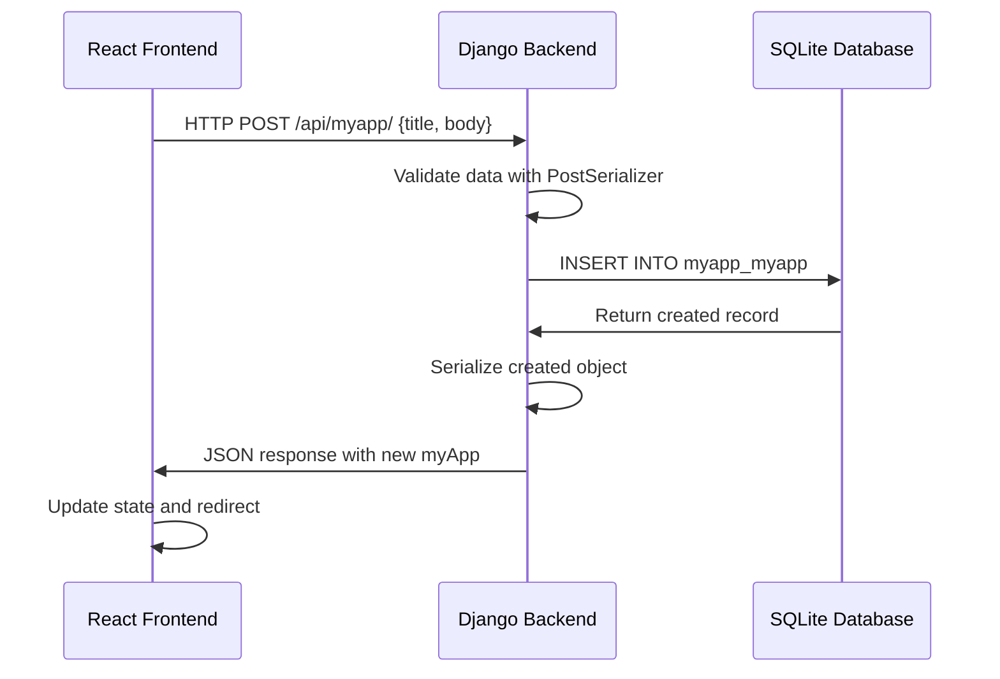
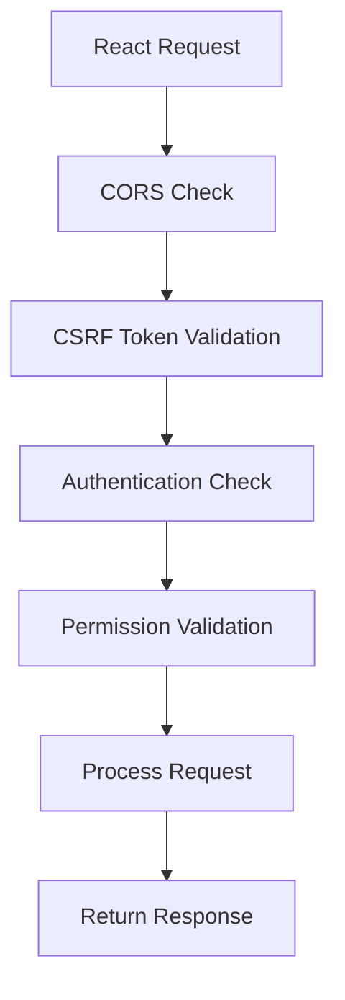

# Django-React Full-Stack Application Design Document

## Overview

This document outlines the design for a full-stack web application using Django as the backend API and React as the frontend client. The application follows a decoupled architecture where Django provides RESTful APIs consumed by a React single-page application.

### Project Structure
```
django-react/
├── setup/                    # Django Backend
│   ├── myApp/               # Main Django Application
│   │   ├── api/             # API Layer
│   │   ├── migrations/      # Database Migrations
│   │   ├── models.py        # Data Models
│   │   └── ...
│   ├── setup/               # Django Project Configuration
│   └── manage.py            # Django Management Commands
└── frontend/                # React Frontend (to be implemented)
```

### Technology Stack
- **Backend**: Django 5.2.6 + Django REST Framework
- **Frontend**: React (to be integrated)
- **Database**: SQLite (development), PostgreSQL (production)
- **API**: RESTful API with JSON responses
- **CORS**: django-cors-headers for cross-origin requests

## Backend Architecture

### Django Project Structure



### API Endpoints Reference

| Method | Endpoint | Description | Request Body | Response |
|--------|----------|-------------|--------------|----------|
| GET | `/api/myapp/` | List all myApp items | - | Array of myApp objects |
| POST | `/api/myapp/` | Create new myApp item | `{title, body}` | Created myApp object |
| GET | `/api/myapp/{id}/` | Get specific myApp item | - | Single myApp object |
| PUT | `/api/myapp/{id}/` | Update myApp item | `{title, body}` | Updated myApp object |
| PATCH | `/api/myapp/{id}/` | Partial update | `{title}` or `{body}` | Updated myApp object |
| DELETE | `/api/myapp/{id}/` | Delete myApp item | - | 204 No Content |

#### Request/Response Schema

**myApp Object Schema:**
```json
{
  "id": "integer",
  "title": "string (max 100 chars)",
  "body": "string (text field)"
}
```

**Example API Response:**
```json
{
  "id": 1,
  "title": "Sample Title",
  "body": "Sample body content"
}
```

### Data Models & ORM Mapping



**Model Definition:**
- **myApp Model**
  - `id`: Auto-increment primary key
  - `title`: CharField with max_length=100
  - `body`: TextField for longer content
  - `__str__()`: Returns formatted string representation

### Business Logic Layer

#### myApp Feature Architecture



**PostViewSet Responsibilities:**
- Handle CRUD operations for myApp objects
- Automatic pagination and filtering
- Content negotiation (JSON responses)
- Error handling and validation
- Extends ModelViewSet for full CRUD functionality

**PostSerializer Responsibilities:**
- Data validation and transformation
- JSON serialization/deserialization
- Field-level and object-level validation
- Maps myApp model to JSON format

### Middleware & Configuration

**Active Middleware Stack:**
1. `SecurityMiddleware` - Security headers
2. `SessionMiddleware` - Session management
3. `CorsMiddleware` - CORS handling for React frontend
4. `CommonMiddleware` - Common functionality
5. `CsrfViewMiddleware` - CSRF protection
6. `AuthenticationMiddleware` - User authentication
7. `MessageMiddleware` - Message framework
8. `ClickjackingMiddleware` - Clickjacking protection

**CORS Configuration:**
- Allowed origins: `https://localhost:5173` (React dev server)
- Configured for React frontend integration
- Enables cross-origin requests from React development server

## Frontend Architecture

### Component Architecture



#### Component Hierarchy

**Root Level Components:**
- `App`: Main application container
- `Header`: Navigation and branding
- `Footer`: Site footer information

**Feature Components:**
- `myAppList`: Display list of myApp items
- `myAppDetail`: Show individual myApp details
- `myAppForm`: Create/edit myApp items
- `myAppItem`: Individual item in list view

#### Props/State Management

**Component Props Structure:**
```javascript
// myAppItem Props
{
  item: {
    id: number,
    title: string,
    body: string
  },
  onEdit: (id) => void,
  onDelete: (id) => void
}

// myAppForm Props
{
  item?: myAppObject,
  onSubmit: (data) => void,
  onCancel: () => void
}
```

**State Management Strategy:**
- Local component state for UI interactions
- Context API for global app state
- Custom hooks for API operations

### Routing & Navigation

```mermaid
graph LR
    A[/] --> B[Home Page]
    A --> C[/myapp] --> D[myApp List]
    A --> E[/myapp/:id] --> F[myApp Detail]
    A --> G[/myapp/new] --> H[Create myApp]
    A --> I[/myapp/:id/edit] --> J[Edit myApp]
```

**Route Configuration:**
- `/` - Home/dashboard page
- `/myapp` - List all myApp items
- `/myapp/:id` - View specific myApp item
- `/myapp/new` - Create new myApp item
- `/myapp/:id/edit` - Edit existing myApp item

### API Integration Layer

#### HTTP Client Configuration

```javascript
const API_BASE_URL = 'http://localhost:8000/api';

const apiClient = {
  baseURL: API_BASE_URL,
  timeout: 10000,
  headers: {
    'Content-Type': 'application/json',
  }
};
```

#### API Service Methods

```javascript
const myAppService = {
  getAll: () => GET('/myapp/'),
  getById: (id) => GET(`/myapp/${id}/`),
  create: (data) => POST('/myapp/', data),
  update: (id, data) => PUT(`/myapp/${id}/`, data),
  delete: (id) => DELETE(`/myapp/${id}/`)
};
```

#### Error Handling Strategy



## Data Flow Between Layers

### Request Flow Architecture



### Create Operation Flow



### Authentication & Security Flow



## Testing Strategy

### Backend Testing

**Unit Testing Framework**: Django TestCase
- Model testing for data validation
- Serializer testing for API contracts
- ViewSet testing for endpoint behavior

**Test Categories:**
- **Model Tests**: Validate field constraints and methods
- **API Tests**: Test all CRUD endpoints
- **Integration Tests**: Test complete request/response cycles

**Example Test Structure:**
```python
class myAppModelTest(TestCase):
    def test_string_representation(self):
        # Test __str__ method
        
    def test_field_validation(self):
        # Test model field constraints

class PostViewSetTest(APITestCase):
    def test_get_myapp_list(self):
        # Test GET /api/myapp/
        
    def test_create_myapp(self):
        # Test POST /api/myapp/
        
    def test_post_serializer(self):
        # Test PostSerializer validation
```

### Frontend Testing

**Testing Libraries**:
- Jest for unit testing
- React Testing Library for component testing
- Cypress for end-to-end testing

**Test Categories:**
- **Component Tests**: Render behavior and user interactions
- **API Integration Tests**: Mock API responses
- **E2E Tests**: Complete user workflows

### Integration Testing

**API Integration Testing:**
- Test Django API endpoints with React HTTP client
- Validate request/response formats
- Test error handling scenarios
- Performance testing for API response times

**Database Integration:**
- Test migrations and schema changes
- Validate data integrity constraints
- Test backup and restore procedures